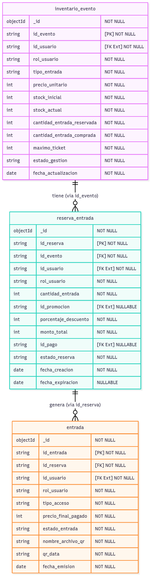

# 🗄️ Base de Datos — Microservicio de Entradas e Inventario

Repositorio y especificación técnica de la **Capa de Persistencia y Base de Datos** para el microservicio de **Entradas e Inventario** de la plataforma **TicketU** (Grupo 3).

El sistema opera bajo el patrón arquitectónico **Database per Service** (base de datos dedicada e independiente), utilizando **MongoDB 7.0** contenerizado con validación estricta a nivel de esquema (`$jsonSchema`), índices de unicidad y expiración automática (TTL).

---

## 🛠️ Stack Tecnológico de Persistencia

* **Motor de Base de Datos:** MongoDB 7.0 (Document Store NoSQL)
* **Panel Visual de Administración:** Mongo Express 1.0.2 (Web GUI)
* **Validación de Esquema:** JSON Schema BSON estricto (`$jsonSchema`)
* **Orquestación Local:** Docker & Docker Compose
* **Responsable / Rol:** Renato Herrera — Desarrollador de Base de Datos

---

## 🧬 Modelo de Datos y Topología Acíclica

Para garantizar integridad referencial y evitar dependencias circulares (libre de ciclos), el dominio implementa una topología lineal en cascada tipo Grafo Dirigido Acíclico (DAG):

```
[inventario_evento] ──(tiene via id_evento)──> [reserva_entrada] ──(genera via id_reserva)──> [entrada]
```



### Colecciones del Dominio

1. **`inventario_evento`:**
   * **Propósito:** Control maestro de aforo, stock inicial/actual, precios unitarios, tipos de entrada (`PAGADA`, `GRATUITA`), cantidad reservada/comprada y límites por usuario (`maximo_ticket`).
   * **Clave Primaria (PK):** `id_evento` (Índice único).
   * **Rol de Usuario:** Exclusivamente `"ORGANIZADOR"`.

2. **`reserva_entrada`:**
   * **Propósito:** Retención y bloqueo temporal de cupos durante el proceso de compra concurrentes.
   * **Clave Primaria (PK):** `id_reserva` (Índice único).
   * **Relación (FK):** `id_evento` (referencia a `inventario_evento`).
   * **Mecanismo TTL:** Cuenta con un índice TTL sobre `fecha_expiracion` que libera y purga automáticamente la reserva a los **15 minutos** si el pago no es consolidado.
   * **Rol de Usuario:** Exclusivamente `"CLIENTE"`.

3. **`entrada`:**
   * **Propósito:** Registro inmutable del ticket definitivo emitido una vez consolidado el pago con éxito.
   * **Clave Primaria (PK):** `id_entrada` (Índice único).
   * **Relación (FK):** `id_reserva` (referencia a `reserva_entrada`).
   * **Seguridad y Control de Acceso:** Identificador único `id_codigo_qr` (Índice único) para validación en puerta por el microservicio de Check-in.
   * **Rol de Usuario:** Exclusivamente `"CLIENTE"`.

---

## 📂 Contenido de la Carpeta `database/`

Toda la ingeniería, documentación técnica formal y scripts de aprovisionamiento residen en la carpeta [`database/`](./database):

| Archivo / Recurso | Tipo | Descripción y Alcance |
| :--- | :--- | :--- |
| [`init_db.js`](./database/init_db.js) | **Script de Inicialización** | Script automatizado para MongoDB 7.0. Crea la base de datos `ticketu_entradas_db`, aplica esquemas estrictos `$jsonSchema` (BSON), índices únicos, índice TTL y carga datos semilla (*seeds*) con 3 escenarios de prueba: evento pagado, gratuito y agotado. |
| [`BIBLIA_BD_ENTRADAS_INVENTARIO.md`](./database/BIBLIA_BD_ENTRADAS_INVENTARIO.md) | **Especificación Técnica** | Documento maestro de ingeniería de base de datos a nivel industrial. Cubre cumplimiento de criterios BD1-BD4, flujo transaccional de 5 fases, gobierno de datos (`snake_case` singular) y matriz de aislamiento de dominio. |
| [`BIBLIA_BD_ENTRADAS_INVENTARIO.pdf`](./database/BIBLIA_BD_ENTRADAS_INVENTARIO.pdf) | **Documento Oficial PDF** | Versión formal en PDF de la especificación técnica para entregas académicas y auditoría de arquitectura. |
| [`DICCIONARIO_DATOS.md`](./database/DICCIONARIO_DATOS.md) | **Diccionario de Datos** | Detalle exhaustivo de cada campo, tipos de datos BSON, obligatoriedad (`NOT NULL` / `NULLABLE`), validaciones de enumeración y roles por colección. |
| [`schema.dbml`](./database/schema.dbml) | **Esquema DBML** | Definición del esquema en formato Database Markup Language para herramientas como dbdocs o dbdiagram.io. |
| [`diagrama.mmd`](./database/diagrama.mmd) | **Diagrama Mermaid** | Diagrama entidad-relación en código Mermaid para renderizado interactivo en Markdown. |
| [`diagrama_relacional.png`](./database/diagrama_relacional.png) / [`.svg`](./database/diagrama_relacional.svg) | **Diagramas Gráficos** | Renderizado visual oficial del diagrama relacional y topología de base de datos. |
| [`INSTRUCCIONES_PANEL_VISUAL.txt`](./database/INSTRUCCIONES_PANEL_VISUAL.txt) | **Guía Rápida** | Resumen ejecutivo con instrucciones de conexión directa y acceso al panel web. |

---

## 🐳 Despliegue con Docker y Ejecución Local

La infraestructura de persistencia se encuentra orquestada en el archivo [`docker-compose.yml`](./docker-compose.yml), el cual levanta dos contenedores interconectados:

1. **`mongodb` (`ticketu_entradas_mongo`):** Motor de base de datos MongoDB 7.0 expuesto en el puerto `27017`. Monta automáticamente `database/init_db.js` en `/docker-entrypoint-initdb.d/` para provisionar la base de datos en su primer inicio y persiste la información en el volumen `mongo_entradas_data`.
2. **`mongo-express` (`ticketu_entradas_gui`):** Interfaz gráfica web expuesta en el puerto `8081` para interactuar con las colecciones y documentos en tiempo real.

### 1. Iniciar la Base de Datos y el Panel Visual

Abre una terminal en la raíz del proyecto y ejecuta:

```bash
docker compose up -d
```

> 💡 **Inicialización automática:** En el primer arranque, MongoDB detecta y ejecuta automáticamente el script [`database/init_db.js`](./database/init_db.js), creando las colecciones con sus esquemas `$jsonSchema` y los datos de prueba iniciales.

---

### 2. Acceder al Panel Visual Web (Mongo Express)

Una vez iniciados los contenedores, ingresa desde tu navegador web a:

👉 **[http://localhost:8081](http://localhost:8081)**

* **Autenticación:** No requiere usuario ni contraseña (acceso directo en entorno local).
* **Navegación:** Haz clic sobre la base de datos **`ticketu_entradas_db`**.
* **Operaciones disponibles:** Podrás visualizar, filtrar, insertar, editar y eliminar documentos en las 3 colecciones del dominio (`inventario_evento`, `reserva_entrada`, `entrada`).

---

### 3. Conexión desde el Backend y Clientes Externos

Para conectar aplicaciones backend (Node.js, FastAPI, Python, Java, etc.) o clientes GUI de escritorio (MongoDB Compass, DBeaver) a esta instancia local:

```env
# URI de Conexión Estándar
MONGODB_URI=mongodb://localhost:27017/ticketu_entradas_db
```

* **Host:** `localhost` (o `mongodb` si se conecta desde otro contenedor en la misma red de Docker)
* **Puerto:** `27017`
* **Base de datos:** `ticketu_entradas_db`
* **Autenticación:** Deshabilitada para entorno local de desarrollo.

---

### 4. Comandos de Gestión y Administración

* **Ver estado de los contenedores:**
  ```bash
  docker compose ps
  ```

* **Ver logs de inicialización de MongoDB:**
  ```bash
  docker compose logs -f mongodb
  ```

* **Detener los servicios manteniendo los datos:**
  ```bash
  docker compose down
  ```

* **Reinicio limpio (elimina volumen persistente y re-ejecuta `init_db.js` desde cero):**
  ```bash
  docker compose down -v
  docker compose up -d
  ```
