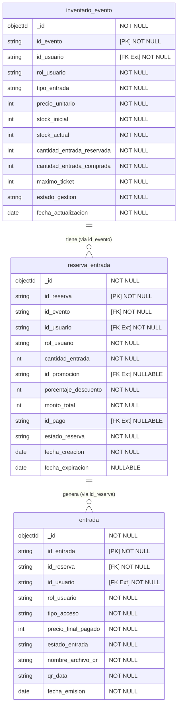

# Diccionario de Datos - Entradas Ticketu

## Diagrama Relacional (Extraído de MongoDB Local)

El presente diccionario de datos documenta la estructura de las colecciones que gestionan el inventario, las reservas y las entradas dentro de la base de datos MongoDB para el dominio de Entradas del sistema Ticketu.

## 1. Colección: `inventario_evento`

Contiene la información general de inventario de cada evento, determinando la cantidad de entradas disponibles, precios, y el estado de la gestión de entradas del evento.

| Atributo | Tipo BSON | PK / FK | Nullable | Descripción |
| :--- | :--- | :--- | :--- | :--- |
| `_id` | `objectId` | PK (Auto) | No | Identificador interno de MongoDB. |
| `id_evento` | `string` | PK (Lógico) | No | Identificador único del evento a nivel de dominio. |
| `id_usuario` | `string` | FK | No | Identificador del usuario organizador del evento (Referencia a la entidad Usuario externa). |
| `rol_usuario` | `string` | - | No | Rol del usuario, debe ser `ORGANIZADOR`. |
| `tipo_entrada` | `string` | - | No | Determina si la entrada es `PAGADA` o `GRATUITA`. |
| `precio_unitario` | `int` | - | No | Precio base por cada entrada del evento (mínimo 0). |
| `stock_inicial` | `int` | - | No | Cantidad inicial total de entradas disponibles para el evento. |
| `stock_actual` | `int` | - | No | Entradas que aún están disponibles para ser adquiridas o reservadas. |
| `cantidad_entrada_reservada` | `int` | - | No | Cantidad de entradas temporalmente reservadas que aún no se han consolidado (pagado). |
| `cantidad_entrada_comprada` | `int` | - | No | Cantidad de entradas que ya han sido pagadas/consolidadas. |
| `maximo_ticket` | `int` | - | No | Máximo número de entradas que un cliente puede comprar en una sola transacción. |
| `estado_gestion` | `string` | - | No | Estado del inventario del evento: `BORRADOR`, `PUBLICADO`, `FINALIZADO`, `CANCELADO`, `AGOTADO`. |
| `fecha_actualizacion` | `date` | - | No | Fecha del último cambio en el inventario o estado. |

---

## 2. Colección: `reserva_entrada`

Registra las intenciones de compra (reservas) que un cliente realiza. Tienen un tiempo de vida (TTL) tras el cual expiran si no son consolidadas.

| Atributo | Tipo BSON | PK / FK | Nullable | Descripción |
| :--- | :--- | :--- | :--- | :--- |
| `_id` | `objectId` | PK (Auto) | No | Identificador interno de MongoDB. |
| `id_reserva` | `string` | PK (Lógico) | No | Identificador único de la reserva. |
| `id_evento` | `string` | FK | No | Evento asociado a la reserva (Referencia a `inventario_evento`). |
| `id_usuario` | `string` | FK | No | Identificador del usuario que realiza la reserva (Referencia a la entidad Usuario externa). |
| `rol_usuario` | `string` | - | No | Rol del usuario, debe ser `CLIENTE`. |
| `cantidad_entrada` | `int` | - | No | Cantidad de entradas solicitadas en esta reserva (mínimo 1). |
| `id_promocion` | `string` | - | Sí | Identificador de alguna promoción o cupón aplicado, si aplica. |
| `porcentaje_descuento` | `int` | - | No | Porcentaje de descuento aplicado (0 a 100). |
| `monto_total` | `int` | - | No | Costo total de la reserva tras aplicar descuentos. |
| `id_pago` | `string` | - | Sí | Referencia al sistema o pasarela de pagos, una vez pagada. |
| `estado_reserva` | `string` | - | No | Estado actual: `RESERVADO`, `CONSOLIDADO`, `EXPIRADO`, `RECHAZADO`. |
| `fecha_creacion` | `date` | - | No | Fecha y hora en la que se creó la reserva. |
| `fecha_expiracion` | `date` | - | Sí | Fecha límite para el pago antes de que el sistema la libere automáticamente (TTL). |

---

## 3. Colección: `entrada`

Representa cada ticket individual definitivo que un cliente ha adquirido y que servirá como acceso al evento.

| Atributo | Tipo BSON | PK / FK | Nullable | Descripción |
| :--- | :--- | :--- | :--- | :--- |
| `_id` | `objectId` | PK (Auto) | No | Identificador interno de MongoDB. |
| `id_entrada` | `string` | PK (Lógico) | No | Identificador único del ticket generado. |
| `id_reserva` | `string` | FK | No | Reserva origen que dio lugar a la emisión de este ticket (Referencia a `reserva_entrada`). |
| `id_usuario` | `string` | FK | No | Usuario propietario del ticket (Referencia a la entidad Usuario externa). |
| `rol_usuario` | `string` | - | No | Rol del propietario, debe ser `CLIENTE`. |
| `tipo_acceso` | `string` | - | No | Área o categoría de acceso (`GENERAL`). |
| `precio_final_pagado` | `int` | - | No | El precio que efectivamente se pagó por esta entrada individual. |
| `estado_entrada` | `string` | - | No | Estado del ticket, usualmente `EMITIDA` o `ANULADA`. |
| `nombre_archivo_qr` | `string` | - | No | Nombre del recurso para acceder al código QR asociado. |
| `qr_data` | `string` | - | No | Datos o URL codificada en el código QR generado. |
| `fecha_emision` | `date` | - | No | Fecha en la cual se emitió formalmente el ticket. |

---

## Ausencia de Ciclos en las Relaciones

El modelo de datos fue diseñado siguiendo una estructura jerárquica estricta que previene la existencia de ciclos (referencias circulares) entre las colecciones:

1. **`inventario_evento`**: Es la entidad principal e independiente. Solo tiene dependencias hacia entidades externas al dominio (como `id_usuario`).
2. **`reserva_entrada`**: Depende lógicamente de `inventario_evento` (hace referencia a `id_evento`) y de factores externos, pero el inventario no posee referencias directas a una reserva específica.
3. **`entrada`**: Depende exclusivamente de `reserva_entrada` (`id_reserva`). Ninguna de las colecciones padre mantienen arreglos con referencias a sus hijos, rompiendo cualquier posibilidad de referencia circular.

Este diseño unidireccional de relaciones (`Entrada` -> `Reserva` -> `Inventario`) asegura consistencia de los datos, facilita el sharding o la separación futura de los agregados y previene problemas de dependencias cíclicas en operaciones de creación y eliminación.
